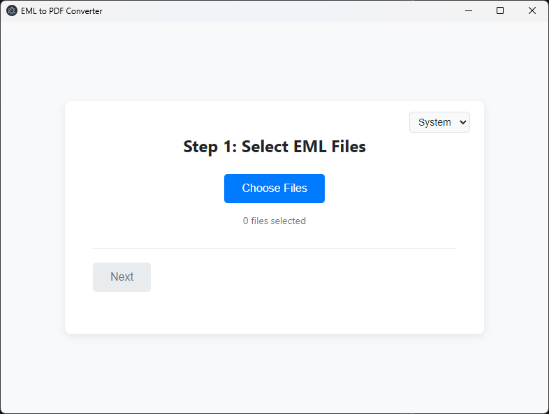

# EML to PDF Converter

A user-friendly desktop application for Windows to convert EML files to PDF, built with Electron.



## Features

- **Batch Conversion:** Convert multiple EML files at once.
- **Automatic Naming:** PDFs are automatically named using the email's subject line.
- **Folder Categorization:** Automatically organize PDFs into folders by month and year (`YYYY-MM`).
- **Modern UI:** A clean, step-by-step wizard interface.
- **Theme Support:** Includes Light, Dark, and System theme options.

## How to Run Locally

To run this application on your own machine, follow these steps:

### Prerequisites

- [Node.js](https://nodejs.org/) (which includes npm)
- [Git](https://git-scm.com/)

### Installation & Setup

1.  **Clone the repository:**
    ```sh
    git clone https://github.com/SupunGHub/eml-to-pdf.git
    ```

2.  **Navigate to the project directory:**
    ```sh
    cd eml-to-pdf
    ```

3.  **Install dependencies:**
    ```sh
    npm install
    ```
    
4.  **Place the required font file:**
    Download the `DejaVuSans.ttf` font file from the [DejaVu Fonts website](https://dejavu-fonts.github.io/Download.html) and place it in the root directory of the project.

### Running the Application

Once the setup is complete, you can start the application with:

```sh
npm start
```

## Creating an Installer

To create a distributable installer for Windows, run the following command:

```sh
npm run dist
```

This will generate an `.exe` installer in the `dist` folder. 